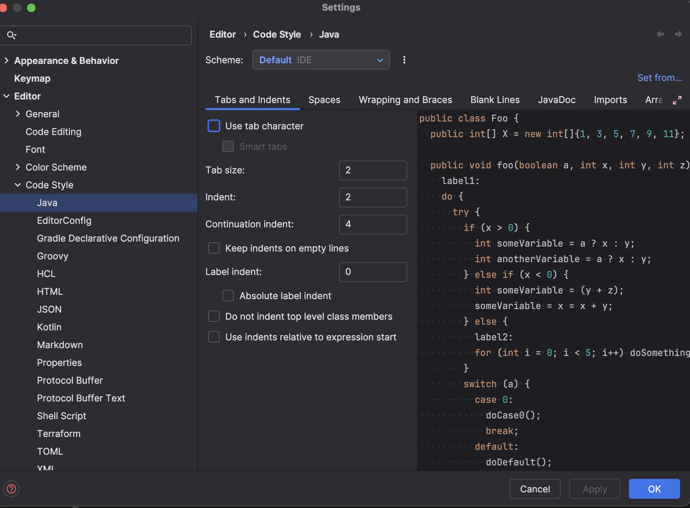
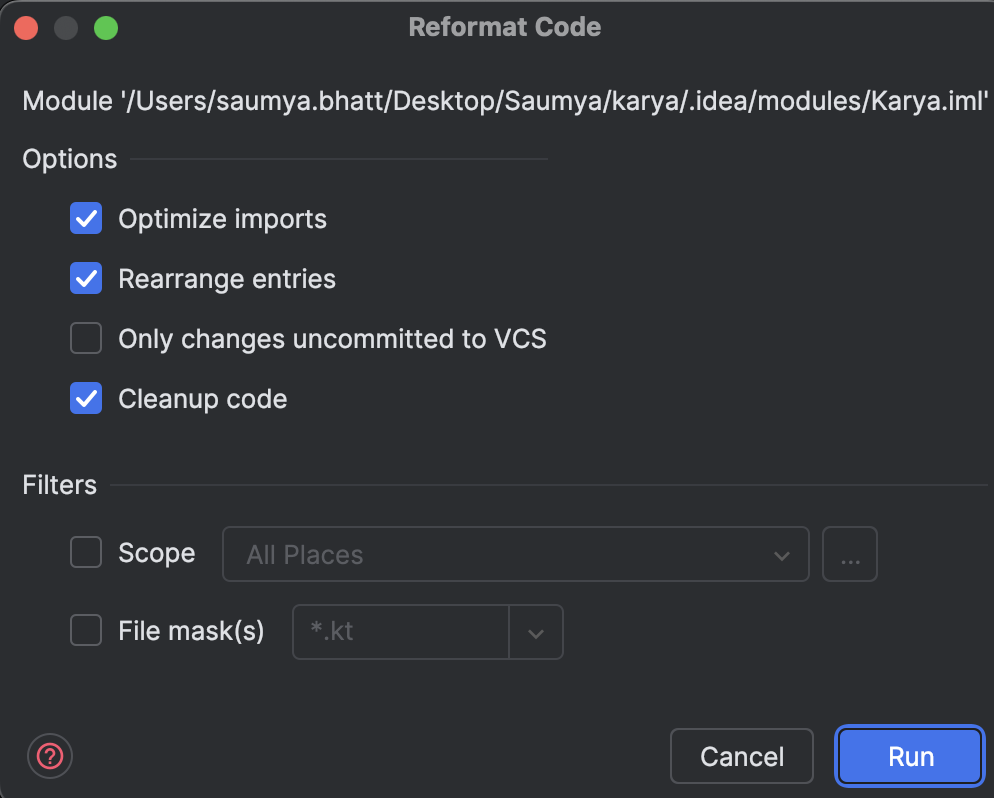

# Contributing to Karya

Firstly, thank you for considering contributing to Karya! Here are a few guidelines to help you get started.

## How can I contribute?

Karya is in no way a finished project. There's always room for improvements. Be it in terms of performance or documentation ro adding new features or fixing bugs! Following are some of the ways one can contribute to Karya:

1. Documentation - There is never enough documentation to explain something simply by reading it. But we can try!
2. Bug Fix - Noticed a bug? Just report it! Or if you're a seluth, go and raise a PR! This is in no way a bug-free software.
3. Performance - Make karya better, faster, stronger!
4. New Features:
   - Make Karya support more data adapters to make it more easier and flexible to integrate with!
   - Add more connectors to provide more functionality to karya
5. Refactoring - There are always better ways to write a code. Go ahead and give it a shot at writing this client better, to make it more concise and easier to read.

## Getting Started

1. Go through the [Architecture Overview](../docs/documentation/ARCHITECTURE) to understand the components of Karya.
2. Set up the application locally by following the [Local Setup](../docs/documentation/LOCAL_SETUP.md) guide.
3. Go through the [Postman Collection](../docs/media/Karya.postman_collection.json) to understand the REST endpoints exposed by the server.
4. Follow the contribution guidelines mentioned below.
5. Fork the repository and start contributing!

## Building Karya

- Karya uses Gradle as the build tool. To build the project, run the following command:

```shell
./gradlew clean build
```

To build the docker images locally, run the following commands:

```shell
docker build -f ./servers/server/deploy/Dockerfile -t karya-server .
docker build -f ./servers/executor/deploy/Dockerfile -t karya-executor .
docker build -f ./servers/scheduler/deploy/Dockerfile -t karya-scheduler .
```

## Linting and Formatting

- [Detekt](https://detekt.dev/) Plugin is being used to enforce code style and formatting
- This is part of the build step hence ensure `./gradlew detekt` runs successfully for the build to succeed.
- Ruleset can be found [here](../configs/detekt.yml)

<details>
<summary><strong>Additional configs for IntelliJ users</strong></summary>

### Set the indentation to space : 2



### While running the Intellij Formatter, check the below options



</details>
