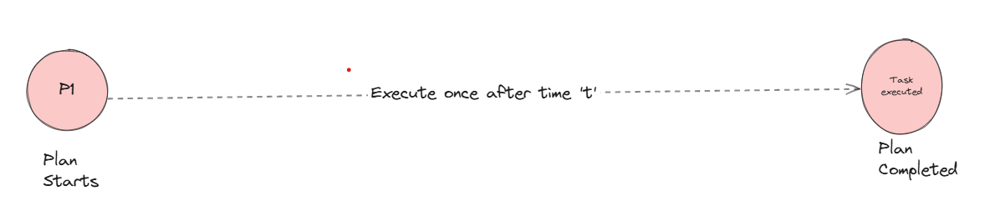
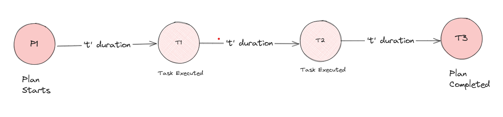
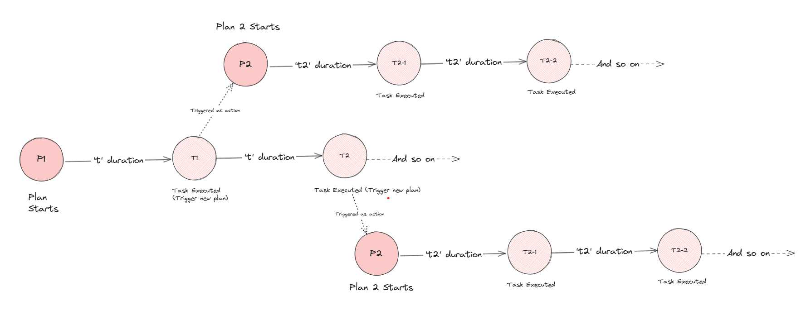
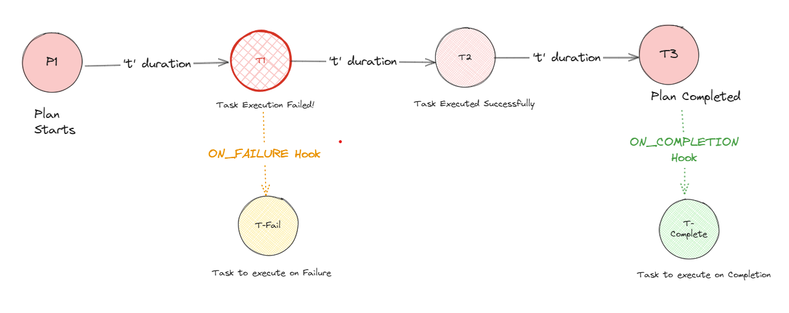
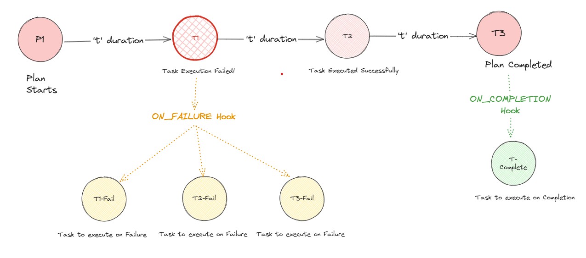
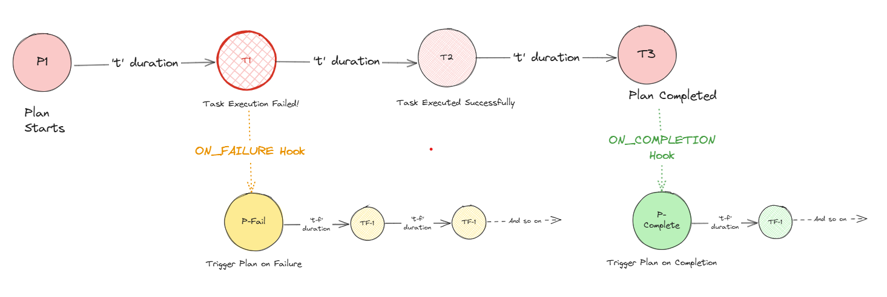

# Karya

Distributed, scalable Task Scheduler built for high throughput.

- [How to contribute](.github/CONTRIBUTING.md)
- [Documentation](./docs/documentation/)
- [Local Setup](./docs/documentation/LOCAL_SETUP.md)
- [API Docs](https://saumya-bhatt.github.io/karya/)

---

## Features

**1. Schedule delayed job** - Will execute after the time duration is passed.



**2. Schedule bounded recurring tasks** - tasks will execute till specified when to stop.



**3. Schedule unbounded recurring tasks** - will run indefinitely.


**4. Chain Plans** - What if a 'task execution' triggers, triggering a new plan? Read more about [Chained Plans](./docs/documentation/CONNECTORS.md/#chained-plans)

> Note: This may result in exponentially scheduling tasks. But Karya can be configured to adjust the _tree-depth_ of chained plans. 



**5. Attach hooks** - [Hooks](./docs/documentation/HOOKS.md) can be attached to each job, to perform any reactive action.



**6. Trigger multiple Actions in hook** - One can attach multiple actions to a plan's hook.



**7. Extending Hooks** - What if one could trigger a whole new plan instead of taking just reactive actions?



**8. Multiple Actions to Configure** - Configure from a range of actions on _what to do_ once a task is to be executed.


---

## Supported Platforms

### Karya Nodes

Karya Nodes can be run completely as docker containers.

- [Running Karya Server](./docs/documentation/LOCAL_SETUP.md#running-karya-server)
- [Running Karya Executor](./docs/documentation/LOCAL_SETUP.md#running-karya-executor)
- [Running Karya Scheduler](./docs/documentation/LOCAL_SETUP.md#running-karya-scheduler)

### Providers

Karya currently requires the following external components to work: a SQL-based database, a key-value-based one, and a queue.

Karya provides out-of-the-box integration with the below given components with more on the way. For more details, refer - [Data Adapters](./docs/documentation/DATA_ADAPTERS.md)

| Repo Adapter                                     | Locks Adapter                                            | Queue Adapter                         |
|--------------------------------------------------|----------------------------------------------------------|---------------------------------------|
| [Postgres](https://www.postgresql.org/)          | [Redis](https://redis.io/)                               | [RabbitMQ](https://www.rabbitmq.com/) |
| [AWS Aurora](https://aws.amazon.com/rds/aurora/) | [ElastiCache](https://aws.amazon.com/elasticache/redis/) | [SQS](https://aws.amazon.com/sqs/)    |

### Clients

Users can use the following clients to interact with Karya from their preferred environment.

- [Java 17 Client](./docs/documentation/CLIENT.md)
- [Python Client](https://github.com/Saumya-Bhatt/karya-python-client)
- [Javascript Client](https://github.com/Saumya-Bhatt/karya-javascript-client)
- REST API - [postman collection](./docs/media/Karya.postman_collection.json)
---

## Quick Start

This section will help set up Karya locally so that you can start scheduling jobs in no time!

A few things to note: If you haven't already gone through the [architecture overview](./docs/documentation/ARCHITECTURE.md), Karya requires an SQL database, a queue, and a key-value store to work with. For our local setup, we will be using Postgres, Redis, and RabbitMQ, respectively.

> For more detailed local setup, please take a look at the [local setup documentation](./docs/documentation/LOCAL_SETUP.md).

### Pre-requisites

Docker and Docker Compose should be installed on your machine, and the engine is running.

### Step 1: Setup providers

Run the below command to set up and run Postgres, Redis, and RabbitMQ containers.

```bash
docker-compose -f ./docs/local-setup/providers.docker-compose.yml up -d
``` 

### Step 2: Create your configuration yml files

Create the following .yml files on your machine:

| File Name       | Documentation                                                                                                  | Description                                                                                       | Example                                                               |
|-----------------|----------------------------------------------------------------------------------------------------------------|---------------------------------------------------------------------------------------------------|-----------------------------------------------------------------------|
| _providers.yml_ | [Data Adapters](./docs/documentation/DATA_ADAPTERS.md)                                                         | Contains the connection details for Postgres, Redis and RabbitMQ                                  | [psql-redis-rabbitmq.providers.yml](./configs/providers/psql-redis-rabbitmq.providers.yml) |
| _server.yml_    | [Karya Server](./docs/documentation/COMPONENTS.md#Server)                                                      | Contains the server configuration details. This will serve as the client interfacing side         | [server.yml](./configs/server.yml)                                  |
| _executor.yml_  | [Karya Executor](./docs/documentation/COMPONENTS.md#Executor) [Connectors](./docs/documentation/CONNECTORS.md) | Contains the executor configuration details. This is what will provide the functionality to Karya | [executor.yml](./configs/executor.yml)                                |
| _scheduler.yml_ | [Karya Scheduler](./docs/documentation/COMPONENTS.md#Scheduler)                                                | Contains the scheduler configuration details. This is the heart of Karya                           | [scheduler.yml](./configs/scheduler.yml)                               |

### Step 3: Run Karya Servers

Run the below command to start the Karya servers via docker-compose

> __NOTE__ : Make sure to change the paths while mounting the volumes in the below command to the paths where you have stored the .yml files.

```bash
docker-compose -f ./docs/local-setup/karya.docker-compose.yml up -d
```

### Step 4: Start using Karya!

Use the client of your choice and start scheduling tasks:

#### [Python Client](https://github.com/Saumya-Bhatt/karya-python-client)
#### [Javascript Client](https://github.com/Saumya-Bhatt/karya-javascript-client)
#### [Java Client](./docs/documentation/CLIENT.md)

---

## Why Karya?

There are several task schedulers out there. Why to choose Karya? Here are the reasons:

1. High Throughput – Designed for infinite horizontal scaling.
2. Fault-Tolerant – Uses stateless nodes with external [data-adapters](./docs/documentation/DATA_ADAPTERS.md).
3. Highly Customizable – Configurable with YAML files for [data-adapters](./docs/documentation/DATA_ADAPTERS.md) and [connectors](./docs/documentation/CONNECTORS.md).
4. Fast & Safe – Written in Kotlin with structured concurrency using coroutines.
