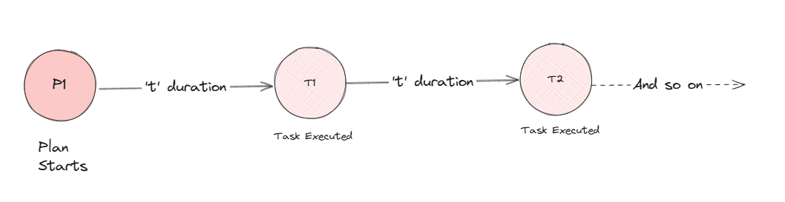

# Karya

Distributed, scalable Task Scheduler built for high throughput.

- [How to contribute](.github/CONTRIBUTING.md)
- [Documentation](./docs/documentation/)
- [Local Setup](./docs/documentation/LOCAL_SETUP.md)
- [API Docs](https://saumya-bhatt.github.io/karya/)

---

## Features

**1. Schedule delayed job** - Will execute after the time duration is passed.


**2. Schedule bounded recurring tasks** - tasks will execute till specified when to stop.


**3. Schedule unbounded recurring tasks** - will run indefinitely.



**4. Chain Plans** - What if a 'task execution' triggers, triggering a new plan! Read more about [Chained Plans](./docs/documentation/CONNECTORS.md/#chained-plans)

> Note: This may result in exponentially scheduling tasks. But Karya can be configured to adjust the _tree-depth_ of chained plans. 


**5. Attach hooks** - [Hooks](./docs/documentation/HOOKS.md) can be attached to each job, to perform any reactive action.


**6. Trigger multiple Actions in hook** - One can attach multiple actions to a plan's hook.


**7. Extending Hooks** - What if one could trigger a whole new plan instead of taking just reactive actions!


**8. Multiple Actions to configure** - Configure from a range of actions on _what to do_ once a task is to be executed.


---

## Supported Platforms

### Karya Nodes

Karya Nodes can be run completely as docker containers.

- [Running Karya Server](./docs/documentation/LOCAL_SETUP.md#running-karya-server)
- [Running Karya Executor](./docs/documentation/LOCAL_SETUP.md#running-karya-executor)
- [Running Karya Scheduler](./docs/documentation/LOCAL_SETUP.md#running-karya-scheduler)

### Providers

Karya currently requires the following external components to work: a SQL based database, a key-value based one and a queue.

Karya provides out of the box integration with the below given components with more on the way. For more details, refer - [Data Adapters](./docs/documentation/DATA_ADAPTERS.md)

| Repo Adapter                                     | Locks Adapter                                            | Queue Adapter                         |
|--------------------------------------------------|----------------------------------------------------------|---------------------------------------|
| [Postgres](https://www.postgresql.org/)          | [Redis](https://redis.io/)                               | [RabbitMQ](https://www.rabbitmq.com/) |
| [AWS Aurora](https://aws.amazon.com/rds/aurora/) | [ElastiCache](https://aws.amazon.com/elasticache/redis/) | [SQS](https://aws.amazon.com/sqs/)    |

### Clients

Users can use the following clients to interact with Karya from their preferred environment.

- [Java 17 Client](./docs/documentation/CLIENT.md)
- [Python Client](https://github.com/Saumya-Bhatt/karya-python-client) 
- REST API - [postman collection](./docs/media/Karya.postman_collection.json)
---

## Quick Start

This section will help set up Karya locally so that you can start scheduling jobs in no time!

Few things to note; if you haven't already gone through the [architecture overview](./docs/documentation/ARCHITECTURE.md), Karya requires a SQL database, a queue and a key-value store to work with. For our local setup, we will be using `Postgres`, `Redis` and `RabbitMQ` respectively.

> For more detailed local set up, refer to the [local setup documentation](./docs/documentation/LOCAL_SETUP.md).

### Pre-requisites

Docker and Docker Compose should be installed on your machine. If not, you can install it from [here](https://docs.docker.com/get-docker/). Make sure the docker engine is running.

### Step 1 : Setup providers

Run the below command to set up and run Postgres, Redis and RabbitMQ containers.

```bash
docker-compose -f ./docs/local-setup/providers.docker-compose.yml up -d
``` 

### Step 2 : Create your configuration yml files

Create the following .yml files on your machine:

| File Name       | Documentation                                                                                                  | Description                                                                                       | Example                                                               |
|-----------------|----------------------------------------------------------------------------------------------------------------|---------------------------------------------------------------------------------------------------|-----------------------------------------------------------------------|
| _providers.yml_ | [Data Adapters](./docs/documentation/DATA_ADAPTERS.md)                                                         | Contains the connection details for Postgres, Redis and RabbitMQ                                  | [Example File](./configs/providers/psql-redis-rabbitmq.providers.yml) |
| _server.yml_    | [Karya Server](./docs/documentation/COMPONENTS.md#Server)                                                      | Contains the server configuration details. This will serve as the client interfacing side         | [Example File](./configs/server.yml)                                  |
| _executor.yml_  | [Karya Executor](./docs/documentation/COMPONENTS.md#Executor) [Connectors](./docs/documentation/CONNECTORS.md) | Contains the executor configuration details. This is what will provide the functionality to Karya | [Example File](./configs/executor.yml)                                |
| _scheduler.yml_ | [Karya Scheduler](./docs/documentation/COMPONENTS.md#Scheduler)                                                | Contains the scheduler configuration details. This is the heart of Karya                           | [Example File](./configs/scheduler.yml)                               |

### Step 3 : Run Karya Servers

Run the below command to start the Karya servers via docker-compose

> __NOTE__ : Make sure to change the paths while mounting the volumes in the below command to the paths where you have stored the .yml files.

```bash
docker-compose -f ./docs/local-setup/karya.docker-compose.yml up -d
```

### Step 4 : Start using Karya!

Now that you have the Karya setup running, you can start scheduling tasks using the client of your choice. Refer to the below section for more information on how to use the client.

#### [Scheduling tasks using Python Client](https://github.com/Saumya-Bhatt/karya-python-client)
#### [Scheduling tasks using Java Client](./docs/documentation/EXAMPLES.md)

---

## Why Karya?

There are several task schedulers out there. Why to choose Karya? Here are the reasons:

1. >**Built for high throughput**.

   It follows the philosophy: *solve scaling by throwing money at it*, which means one just needs to add one more node and scale horizontally infinitely!

2. >**Fault-tolerant by nature**

   Software like Postgres and Redis have already solved the problem of achieving fault tolerance. Karya nodes are stateless in nature and utilizes the properties of such [data-adapters](./docs/documentation/DATA_ADAPTERS.md) to achieve this goal.

3. >**Highly Pluggable and customizable**

   Be it in terms of [data-adapters](./docs/documentation/DATA_ADAPTERS.md) or [connectors](#connectors). Just specify the properties in a .yml file, and you're good to go! Karya [components](./docs/documentation/COMPONENTS.md) can be customized to suite your use case endlessly!

4. >**Fast, Performant and Safe**

   Being written in Kotlin thereby making it typesafe, it uses coroutines to achieve *structured concurrency* while being thread safe.

---
