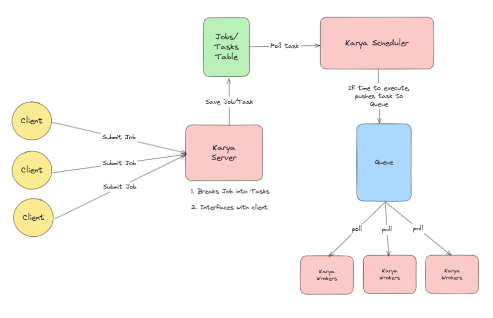

# Architecture

- What comprises Karya - [Components](./COMPONENTS.md)
- What Karya needs to work - [Data Adapters](./DATA_ADAPTERS.md)
- What gives Karya its execution ability - [Connectors](./CONNECTORS.md)
- Extending Karya - [Hooks](./HOOKS.md)

---

## Overview

The Karya system is designed to process jobs submitted by clients. Each job consists of smaller, executable tasks that need to be scheduled, queued, and processed. The system ensures efficient scheduling, execution, and management of tasks using a modular design involving a server, scheduler, queue, and workers.

---

## Components:

This section describes the various components of Karya.

### Internal Components

Read up more about them in the [components section](./COMPONENTS.md)

#### Clients:

- The entry point to the system.
- Clients submit jobs to the Karya Server.

#### Karya Server:

- Acts as the central processing unit for incoming jobs.
- Responsibilities:
  - Breaking Jobs into Tasks: Jobs submitted by clients are broken down into smaller, manageable tasks.
  - Interfacing with Clients: Provides feedback or responses to the clients about their submitted jobs.
  - Storing Tasks: Saves the generated tasks in a Jobs/Tasks Table for tracking and further processing.

#### Karya Scheduler:

- Regularly polls the repo layer for tasks that are ready for execution.
- Pushes tasks to the Queue when their execution time is due.

#### Karya Workers:

- Distributed workers that poll the Queue for tasks.
- Execute the tasks and report results back to the system.

### External Components

Karya requires a few external components (databases, queues, etc.) to make it functional. Read up more about them in [data adapters](./DATA_ADAPTERS.md) Their roles are:

#### Repo Interface (Jobs/Tasks Table):

- A persistent storage system (likely a database).
- Stores metadata and details of jobs and their corresponding tasks.

#### Locks Interface (not shown in doc):

- Karya nodes (be it server/scheduler/executor) take a distributed lock to prevent multiple processing

#### Queue Interface:

- A task execution pipeline.
- Stores tasks waiting to be processed by the workers.
- Tasks are pushed by the scheduler and pulled by the workers.

---

## Process Flow:

1. Job Submission:
   - Clients submit jobs to the Karya Server.
   - The server breaks the job into smaller tasks and saves them in the Jobs/Tasks Table.

2. Task Scheduling:
   - The Karya Scheduler regularly polls the Jobs/Tasks Table.
   - If a task is ready to be executed (based on its execution time or condition), the scheduler pushes the task into the Queue.

3. Task Execution:
   - Karya Workers continuously poll the Queue for tasks.
   - When a task is retrieved, the worker executes it.

4. Completion:
   - Once a worker completes a task, the system can update the Jobs/Tasks Table and notify the client (optional, via [hooks](./HOOKS.md)).

---

## Key Features of this Design

- **Modular Design:** The architecture separates concerns like job breakdown, scheduling, and execution.
- **Scalability:** Multiple workers can poll the queue, allowing the system to handle a large number of tasks concurrently.
- **Scheduling Logic:** The scheduler ensures tasks are executed at the right time.

## Low Level Design

Karya puts a strong emphasis on writing [CLEAN code](https://blog.cleancoder.com/uncle-bob/2012/08/13/the-clean-architecture.html) and a little to somewhat focus on [Domain Driven Design](https://martinfowler.com/bliki/DomainDrivenDesign.html).

The reason being is that Karya being distributed in nature makes it really hard to define a _domain_ when multiple entities are focusing on their own thing while collectively moving towards a common goal. However, within the module (say of Server), domain, entities, use cases, etc. are fairly seen and common.

Interfaces are used liberally. Be it in terms of defining [connectors](./CONNECTORS.md), [data adapters](./DATA_ADAPTERS.md), etc. [Dagger](https://dagger.dev/) is being used to tie up the interfaces to their implementations and power DI.

### Project Structure

This is a high level overview of the different modules in this project.

| **Module**       | **Description**                                                                                                                                  |
|-------------------|--------------------------------------------------------------------------------------------------------------------------------------------------|
| `.github/`        | Contains GitHub-specific configurations, such as workflows for continuous integration and other repository settings.                             |
| `client/`         | Contains the client-side code to interact with the Karya system.                                                                                 |
| `configs/`        | Stores sample configuration files required for various environments and deployments.                                                             |
| `connectors/`     | Module which houses the integration with external systems or services to power the actions that are to be invoked once a task is being executed. |
| `core/`           | Contains the core data models and utility functions which are common across other modules.                                                       |
| `data/`           | Manages data models, database schemas, or data access layers. Includes modules for different data adapters.                                      |
| `docs/`           | Provides documentation related to the project, including setup guides, architecture overviews, and API references.                               |
| `servers/`        | Contains the modules which has the code for servers, schedulers and executors.                                                                   |
