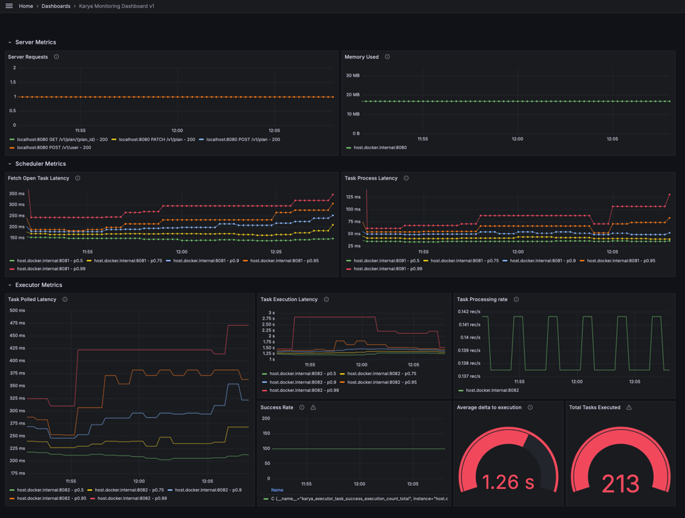

# Observability

Karya nodes exposes a set of metrics that can be used to monitor the health of the system. These metrics are exposed via a Prometheus compatible HTTP endpoint.

## Metrics

The following business metrics are exposed by Karya:

> Karya Server is your usual HTTP Webserver, that exposes the default JVM/GC/Micrometer metrics associated with it. These metrics are not listed here.

| Metric Name | Description | Comments |
|-------------| ------------| ---------|
| `karya_scheduler_task_fetch_latency_seconds_summary` | Summary of time from when the task was meant to be executed to when it was fetched by the scheduler and pushed to the internal queue. | This is useful to accordingly adjust the polling frequency. |
| `karya_scheduler_task_process_latency_seconds_summary` | Summary of time from when the task was fetched from the internal queue to when it was processed by the worker and pushed to the external queue. | This is useful to accordingly adjust the number of scheduler workers. |
| `karya_executor_task_polled_latency_summary` | Summary of time from when the task was meant to be executed to when it was fetched by the executor | This is useful to accordingly adjust the polling frequency and set the number of executors. |
| `karya_executor_task_execution_latency_summary` | Summary of time from when the executor started executing the task to when it was marked as complete | Note that Karya will only consider a task to be executed "on-time" once the execution starts. And not when it has been marked as completed. |
| `karya_executor_task_success_execution_count` | Number of tasks that were successfully executed | |
| `karya_executor_task_failed_execution_count` | Number of tasks that failed to execute | |

### Exposed Ports for Metrics

All the metrics are exposed via the following ports and are prometheus compatible:

- `8080/metrics` - Karya Server
- `8081` - Karya Scheduler
- `8082` - Karya Executor

### Grafana Integration

Karya provides a Grafana dashboard that can be used to visualize the metrics. The dashboard can be found [here](../local-setup/observability/Karya_Monitoring_Dashboard_v1.json)

## Alerting

Karya does not provide any alerting mechanism out of the box. However, one can use Prometheus AlertManager to set up alerts based on the metrics exposed by Karya.

Some of the common alerts based on the metrics listed above that can be set up are:

1. Alert when the number of tasks in the external queue exceeds a certain threshold. This can be setup at the `queue` adapter that you are using.
2. Alert when the success rate goes down below a certain threshold.
3. Alert when the latency of fetching tasks from the repo exceeds a certain threshold. This can be used to adjust the polling frequency.
4. Alert when the latency of processing tasks by the scheduler exceeds a certain threshold. This can be used to adjust the number of workers in the scheduler.
5. Alert when the latency of executing tasks by the executor exceeds a certain threshold. This can be used to adjust the number of executors.

> ### Failure Hooks
> 
> One can also attach an [on-failure hook](./HOOKS.md) to a task that can be used to send alerts via email, slack, etc. when a task fails.
